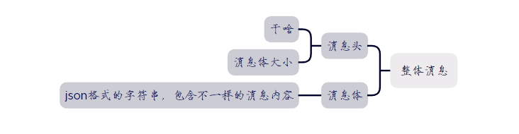
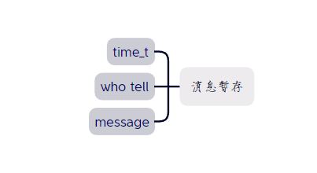
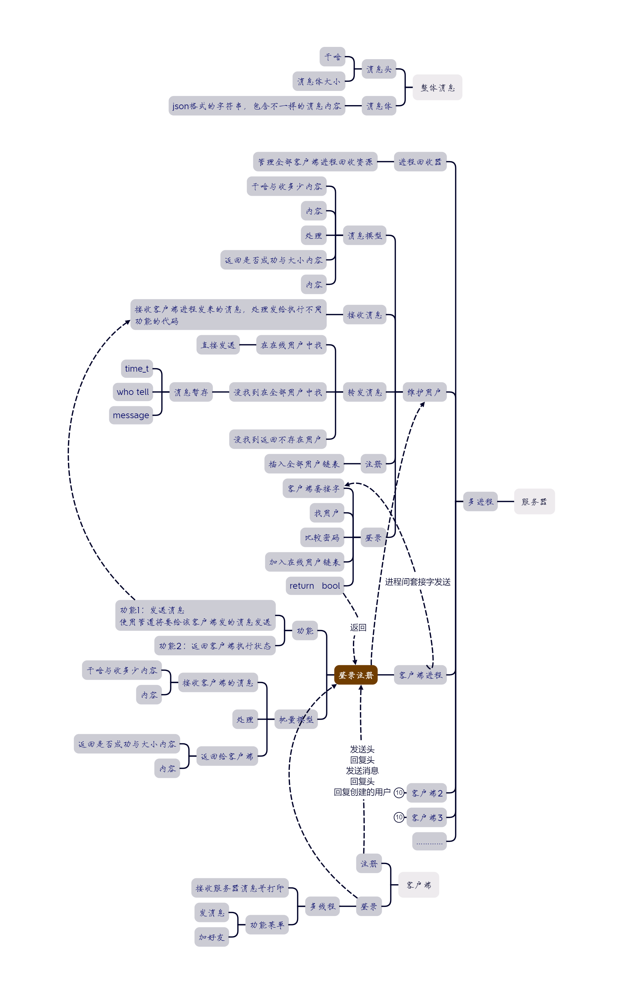
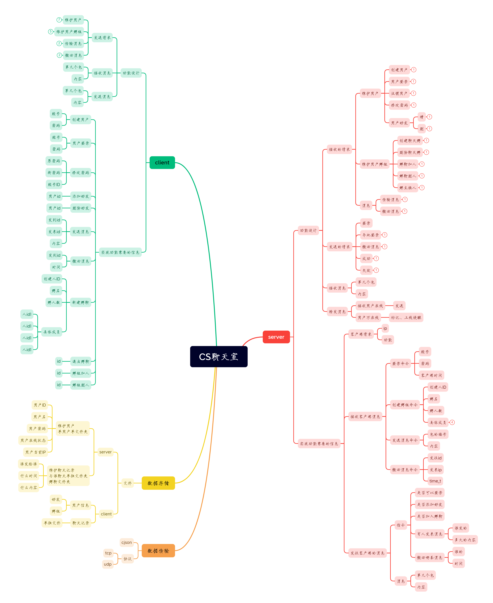

[toc]

# cs架构的聊天系统设计与实现思路

## 系统概述

cs架构的聊天系统是指客户端/服务器（C/S）的模式来设计的聊天软件；

客户端负责提供用户界面和发送接收消息。

服务器负责处理用户的请求，维护聊天记录，转发消息，保证消息的可靠性和安全性。

## 系统功能

cs架构的聊天系统需要实现以下基本功能：

-   用户注册和登录：用户可以通过输入用户名和密码来注册和登录系统，服务器需要验证用户的身份，并返回相应的结果（登录是否成功与注册的ID）。

-   用户管理：用户可以修改自己的个人资料，如昵称、签名等，也可以添加、删除、搜索好友，查看好友的在线状态等（未实现）。

-   消息通信：用户可以与其他用户进行单聊或群聊，发送和接收文本、图片、音频、视频等类型的消息，也可以撤回或删除已发送的消息（图片。音频视频未实现、撤回未实现）。

-   文件传输：用户可以在聊天中发送和接收各种类型的文件，如文档、压缩包、程序等，服务器需要对文件进行存储和转发（未实现）。

-   消息提醒：用户可以在收到新消息时收到通知或提示音，也可以设置免打扰模式或屏蔽某些用户或群组的消息（收到消息有显示，未添加声音，免打扰未实现）。

-   消息加密：用户可以选择对消息进行加密，以保护自己的隐私和安全，服务器需要支持不同的加密算法和协议。（未实现）

	

## 系统设计

-   数据设计(data design)
	-   数据传输设计(data transfer design)
		
		
		
		
	-   数据存储设计
		-   消息暂存
			
			
	
-   客户端设计：

	-   用户界面：设计用户友好的界面，包括消息列表、联系人列表、群组列表等，并提供聊天输入框和发送按钮。
	-   用户认证：实现用户注册、登录和身份验证机制，确保用户的安全性。
	-   消息传输：使用网络通信协议（如TCP/IP）与服务器通信，发送和接收消息；支持多种类型的消息，如文字、图片、音频和视频。
	-   消息存储和同步：将发送的消息存储在本地数据库中，并与服务器进行同步，以便在其他设备上能够获取到最新的消息记录。

-   服务器端设计：

	-   接收和处理消息：服务器接收来自客户端的消息，并处理发送给特定用户或群组的消息。
	-   用户管理：管理用户注册、登录、认证和权限控制。
	-   消息路由和转发：根据消息的目标用户或群组，将消息路由到相应的客户端。
	-   数据存储：将用户的个人信息、联系人列表、消息记录等存储在服务器端的数据库中。
	-   定期备份：定期备份服务器上的数据，以防止数据丢失或损坏。

-   消息传递

	-   数据结构（ `cjson`对象 与 `json`字符串）
	-   在线消息（客户端发给服务器，服务器发给需要发的客户端或暂存）
	-   离线消息（服务器等客户端上线后再告诉客户端谁发来了消息）
	-   广播消息（所有人都可以看到的消息）
	
	实现群组聊天：
	
	-   设计群组机制，允许用户创建、加入和管理群组。
	-   实现群组内的消息通信和同步，确保所有群组成员能收到相应的消息。
	

## 系统功能细分

1.  客户端设计：
	-   用户界面：设计用户友好的界面，包括消息列表、联系人列表、群组列表等，并提供聊天输入框和发送按钮。
	-   用户认证：实现用户注册、登录和身份验证机制，确保用户的安全性。
	-   消息传输：使用网络通信协议（如`TCP/IP`）与服务器通信，发送和接收消息；支持多种类型的消息，如文字、图片、音频和视频。
	-   消息存储和同步：将发送的消息存储在本地数据库中，并与服务器进行同步，以便在其他设备上能够获取到最新的消息记录。
	
2.  服务器端设计：
	-   接收和处理消息：服务器接收来自客户端的消息，并处理发送给特定用户或群组的消息。
	-   用户管理：管理用户注册、登录、认证和权限控制。
	-   消息路由和转发：根据消息的目标用户或群组，将消息路由到相应的客户端。
	-   数据存储：将用户的个人信息、联系人列表、消息记录等存储在服务器端的数据库中。
	-   定期备份：定期备份服务器上的数据，以防止数据丢失或损坏。（未实现、但是写了一个shell脚本用于备份）
	
3.  实现实时通信：
	-   使用Socket技术建立客户端与服务器之间的长连接，以实现实时消息传输。
	
4.  实现离线消息：
	-   当用户离线时，将离线期间收到的消息存储在服务器上，直到用户再次上线时进行同步。
	-   客户端在上线时，先检查服务器上是否有未读的离线消息，再进行同步。
	
6.  实现群组聊天：（暂时所有人在一个群组中）
	-   设计群组机制，允许用户创建、加入和管理群组。
	
	-   实现群组内的消息通信和同步，确保所有群组成员能收到相应的消息。
	
	    
	    
	    

## 系统实现

### server

1.   接听某个端口（等待客户端的命令）
2.   创建，删除用户
3.   用户维护（注册，登录，删除）
4.   接收用户发送的消息
5.   进程之间套接字传递
6.   向用户发送消息
7.   消息暂存

### client

1.   接听服务器消息
2.   注册以及登录
3.   消息监听
4.   消息发送


## 项目难点

1.   `json`对象的使用

     `josn`对象可以十分方便的通过键值对进行操作（“key”: value）

     `josn`对象通过转换为字符串进行消息发送、读写文件

2.   多进程管理同一用户链表

     可以单独开一个进程用于管理用户链表

3.   进程之间文件描述符的发送与接收（必须使用unix域socket）

     由于每个客户端与服务器建立socket连接时，服务器会单独为其创建一个进程并在进程中创建一个套接字，所以之前创建的进程中没有套接字的相关信息。

     解决方案

     由于套接字的本质是文件描述符，而文件描述符不仅仅是一个`int`，它通常在PCB中储存着一些信息。

     假设我们创建两个子进程，按照创建顺序分别叫做进程一与进程二。在进程二中创建一个文件描述符，那么我们在进程一中无法使用这个文件描述符；这时候我们可以使用数据结构`msghdr`保存我们需要发送的文件描述符的信息；

     ```c
     #include<sys/socket.h>
     struct msghdr  {
     	//消息的协议地址  协议地址和套接口信息
     	//在非连接的UDP中，发送者要指定对方地址端口，接受方用于的到数据来源，如果不需要的话可以设置为NULL
     	//（在TCP或者连接的UDP中，一般设置为NULL）
         void* msg_name ;   
         /*  地址的长度  */
         socklen_t msg_namelen ;    
         /*  多io缓冲区的地址  */ 
         struct iovec  * msg_iov ;   
         /*  缓冲区的个数  */ 
          int  msg_iovlen ;   
          /*  辅助数据的地址  */ 
         void  * msg_control ; 
         /*  辅助数据的长度  */   
         socklen_t msg_controllen ;
          /*  接收消息的标识  */    
          int  msg_flags ;  
     } ;
     ```

     ```c
     #include <sys/socket.h>
     #include <fcntl.h>
     #include <stdio.h>
     #include <unistd.h>
     #include <stdlib.h>
     #include <assert.h>
     #include <string.h>
     
     static const int CONTROL_LEN = CMSG_LEN( sizeof(int) );
     
     void send_fd( int fd, int fd_to_send )
     {
         struct iovec iov[1];
         struct msghdr msg;
         char buf[0];
     
         iov[0].iov_base = buf;
         iov[0].iov_len = 1;
         msg.msg_name    = NULL;
         msg.msg_namelen = 0;
         msg.msg_iov     = iov;
         msg.msg_iovlen = 1;
     
         cmsghdr cm;
         cm.cmsg_len = CONTROL_LEN;
         cm.cmsg_level = SOL_SOCKET;
         cm.cmsg_type = SCM_RIGHTS;
         *(int *)CMSG_DATA( &cm ) = fd_to_send;
         msg.msg_control = &cm;
         msg.msg_controllen = CONTROL_LEN;
     
         sendmsg( fd, &msg, 0 );
     }
     
     int recv_fd( int fd )
     {
         struct iovec iov[1];
         struct msghdr msg;
         char buf[0];
     
         iov[0].iov_base = buf;
         iov[0].iov_len = 1;
         msg.msg_name    = NULL;
         msg.msg_namelen = 0;
         msg.msg_iov     = iov;
         msg.msg_iovlen = 1;
     
         cmsghdr cm;
         msg.msg_control = &cm;
         msg.msg_controllen = CONTROL_LEN;
     
         recvmsg( fd, &msg, 0 );
     
         int fd_to_read = *(int *)CMSG_DATA( &cm );
         return fd_to_read;
     }
     
     int main()
     {
         int pipefd[2];
         int fd_to_pass = 0;
     
         int ret = socketpair( PF_UNIX, SOCK_DGRAM, 0, pipefd );
         assert( ret != -1 );
     
         pid_t pid = fork();
         assert( pid >= 0 );
     
         if ( pid == 0 )
         {
             close( pipefd[0] );
             fd_to_pass = open( "test.txt", O_RDWR, 0666 );
             send_fd( pipefd[1], ( fd_to_pass > 0 ) ? fd_to_pass : 0 );
             close( fd_to_pass );
             exit( 0 );
         }
     
         close( pipefd[1] );
         fd_to_pass = recv_fd( pipefd[0] );
         char buf[1024];
         memset( buf, '\0', 1024 );
         read( fd_to_pass, buf, 1024 );
         printf( "I got fd %d and data %s\n", fd_to_pass, buf );
         close( fd_to_pass );
     }
     ```

     

4.   bind() error!

     ```mermaid
     sequenceDiagram
     	主机A->>主机B: FIN <br/> SEQ: 5000<br/> ACK: ----
     	主机B->>主机A: ACK <br/> SEQ: 7500<br/> ASK: 5001
     	主机B->>主机A: FIN <br/> SEQ: 7501<br/> ASK: 5001
     	主机A->>主机B: ASK <br/> SEQ: 5001<br/> ASK: 7502
         activate 主机A
         Note left of 主机A: time_wait
     	deactivate 主机A
     ```

     解决方法：通过套接字可选项将TIME_wait套接字分配给一个监听新端口的套接字避免这个问题。

5.   客户端的分割IO程序

     客户端中通过fork复制套接字实现IO分割，好处是简化程序。

     在子进程中只接收套接字收到的消息，父进程中只发送消息，可以有效避免因为read与write函数造成的阻塞导致不能及时接收消息或发消息。

     

