[toc]

# 项目需求

## 背景

在接触到集群服务器这个概念后一直想写个项目练练手，正好对于之前烂尾的使用C语言写的Linux聊天服务器不是很满意，于是使用C++重新编写这个项目。（旧版代码放置于`history`目录下）

## 集群服务器优势

集群服务器是一种计算机系统，它通过一组松散集成的计算机软件或硬件连接起来高度紧密地协作完成计算任务。相比于普通服务器，集群服务器有以下优点：

1.  **高性能**: 集群服务器可以将多台服务器协同工作，共同处理任务，从而提高系统的整体性能，特别是对于需要大量计算或处理的应用程序。
2.  **高可用性和可靠性**: 集群服务器提供了冗余和容错机制，当一个节点发生故障时，其他节点可以接管工作，确保系统的持续可用性。这种架构足以满足企业的业务需求，需要支持7*24时不间断的服务。
3.  **低成本**: 采用计算机集群比用同等计算性能的大型或超级计算机的成本更理想，性价比更高。
4.  **扩展性强**: 集群系统中节点数目可以增长到几千、甚至上万，其扩展性远超单台超级计算机。当服务器的负载压力增高时，集群的架构模式方便增加服务器来应付这种负载带来的压力，同时，如果负载比原来低了，也可以将某一组服务器协调出来作其他的应用服务，调配方便。
5.  **可管理性**: 整个系统可能在物理上很大，要使集群系统变得易管理，就像管理一个单一映像系统一样。在理想状况下，软硬件模块的插入能做到即插即用。

## 项目功能设计

1.   聊天
2.   加好友
3.   群聊
4.   存储离线消息
5.   部署集群

## 项目使用开源模组

1.   muduo C++网络库构造网络模块
2.   MySQL做数据库存储服务器实例数据
3.   JSON for Modern C++为JSON消息格式序列化与反序列化
4.   CMake管理项目源码与编译
5.   nginx的反向代理做负载均衡服务器
6.   redis 使用其发布订阅的功能做服务器中间件，

# 需求具体实现

## 服务器模块划分

1. 基础模块

    定义了基础类：

    1.   用户
    2.   群组

2. 网络模块

    网络模块负责消息的发送与接收；

    直接使用muduo网络库的`TcpServer`类，并使用`EventLoop`类记录事件循环。

3. 业务模块

    1. 添加用户
        通过客户端的注册请求创建一个新的用户

    2. 添加群聊

        通过用户申请创建群聊

    3. 记录离线消息

        用户不在线时存储聊天消息


4.   数据模块

     1.   表设计
     2.   `user `表：记录注册用户信息；
     3.   `allgroup`表：记录群组信息
     4.   `friend`表：记录好友信息
     5.   `groupuser`表：记录群组承成员信息
     6.   `offlinemessage`表：存储离线消息

5.   服务器中间件设计

     使用redis实现的基于发布订阅机制的服务器中间件

## 各个模块实现

### 基础模块

#### 用户

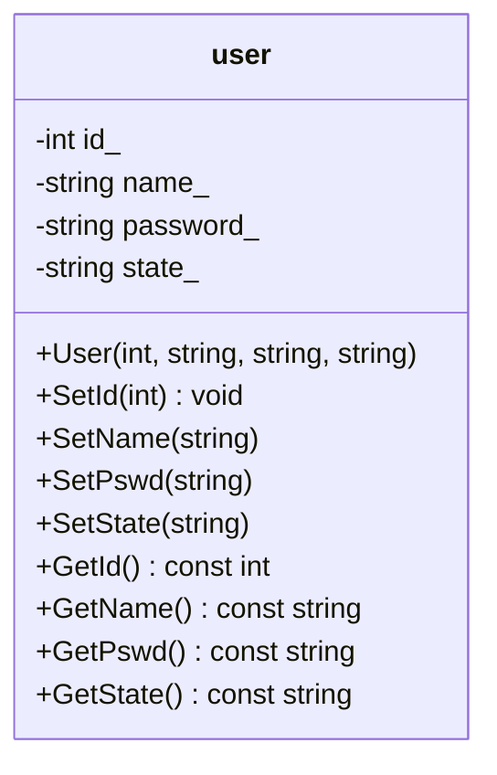


#### 群组

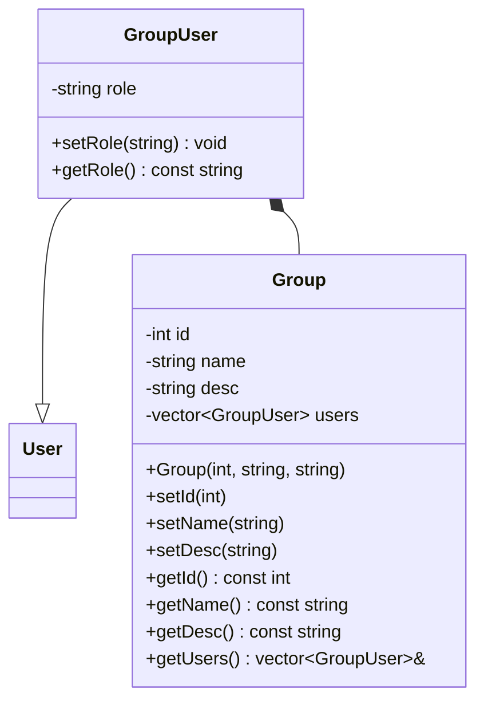


### 数据模块

#### 表设计

`user `表:

```sql
CREATE TABLE `user` (
  `id` int NOT NULL AUTO_INCREMENT,
  `name` varchar(50) DEFAULT NULL,
  `password` varchar(50) DEFAULT NULL,
  `state` enum('online','offline') CHARACTER SET latin1 COLLATE latin1_swedish_ci DEFAULT 'offline',
  PRIMARY KEY (`id`),
  UNIQUE KEY `name` (`name`)
) ENGINE=InnoDB AUTO_INCREMENT=23 DEFAULT CHARSET=utf8mb3
```

`friend`表：

```sql
CREATE TABLE `friend` (
  `userid` int NOT NULL,
  `friendid` int NOT NULL,
  KEY `userid` (`userid`,`friendid`)
) ENGINE=InnoDB DEFAULT CHARSET=utf8mb3
```

`allgroup`表

```sql
CREATE TABLE `allgroup` (
  `id` int NOT NULL AUTO_INCREMENT,
  `groupname` varchar(50) CHARACTER SET latin1 COLLATE latin1_swedish_ci NOT NULL,
  `groupdesc` varchar(200) CHARACTER SET latin1 COLLATE latin1_swedish_ci DEFAULT '',
  PRIMARY KEY (`id`),
  UNIQUE KEY `groupname` (`groupname`)
) ENGINE=InnoDB AUTO_INCREMENT=2 DEFAULT CHARSET=utf8mb3
```

`groupuser`表：

```sql
CREATE TABLE `groupuser` (
  `groupid` int NOT NULL,
  `userid` int NOT NULL,
  `grouprole` enum('creator','normal') CHARACTER SET latin1 COLLATE latin1_swedish_ci DEFAULT NULL,
  KEY `groupid` (`groupid`,`userid`)
) ENGINE=InnoDB DEFAULT CHARSET=utf8mb3
```

`offlinemessage`表：

```sql
CREATE TABLE `offlinemessage` (
  `userid` int NOT NULL,
  `message` varchar(500) NOT NULL
) ENGINE=InnoDB DEFAULT CHARSET=latin1
```

#### 数据库类图

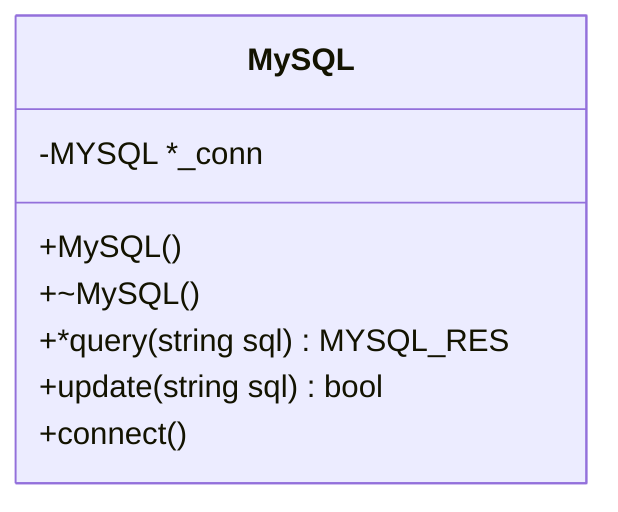


#### 数据表ER关系图

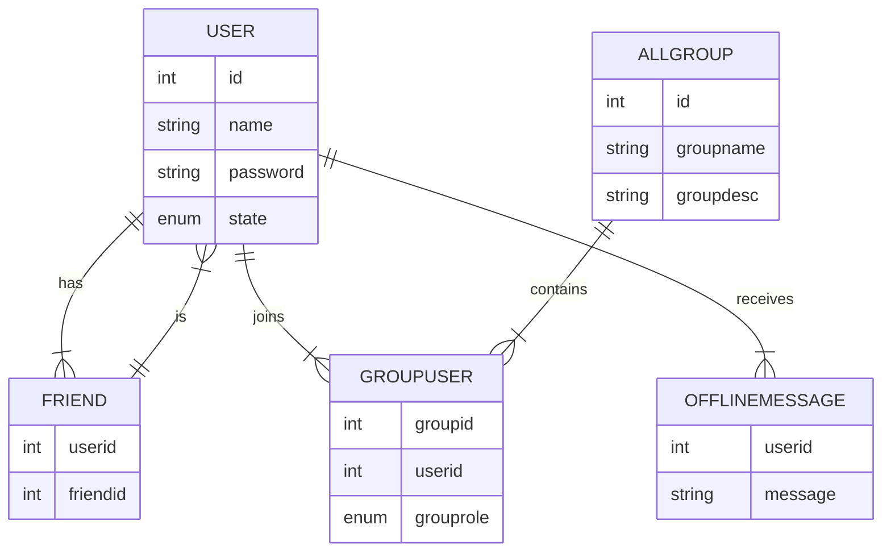


### 网络模块

使用开源项目muduo的TcpServer，在这里列出使用到的方法。

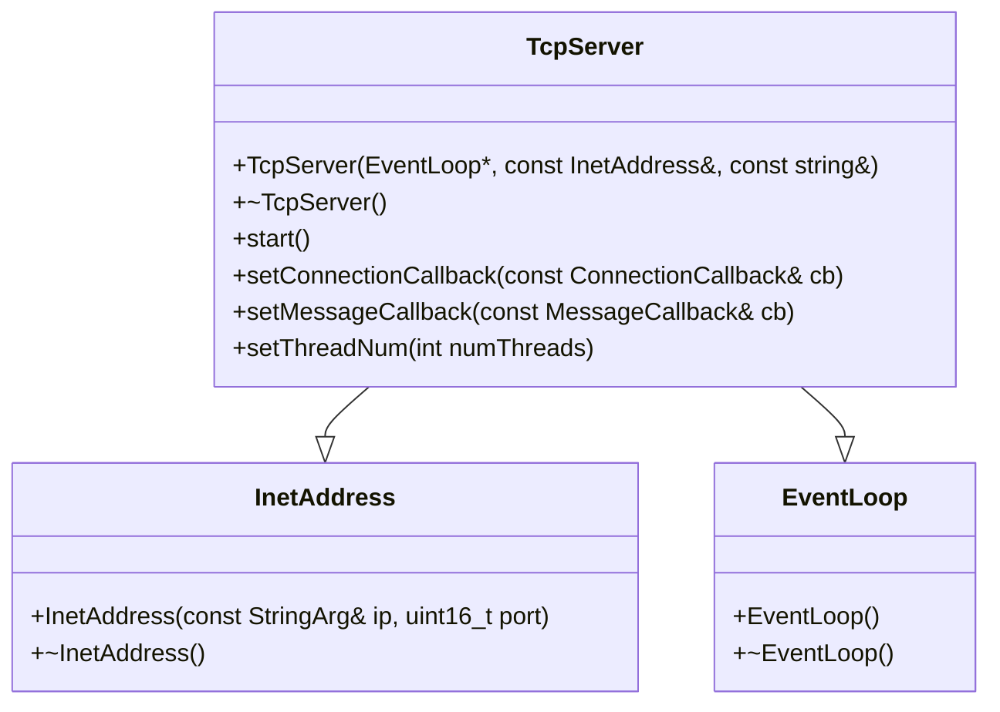


### 业务模块

#### 基础用户模块

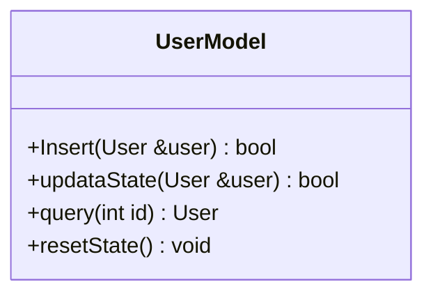

#### 好友模块

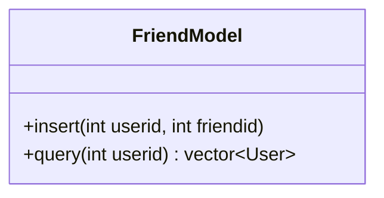

#### 群聊模块

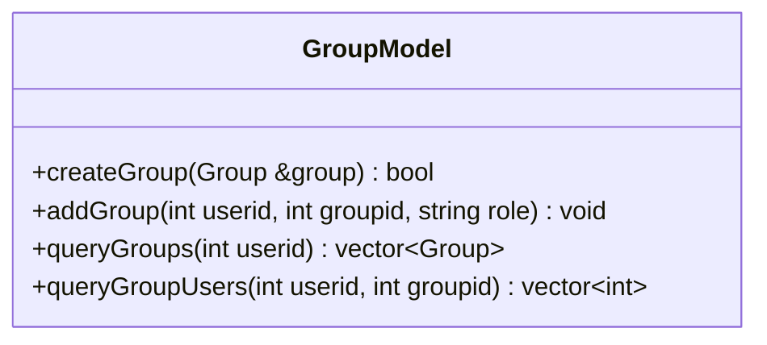

#### 离线消息模块

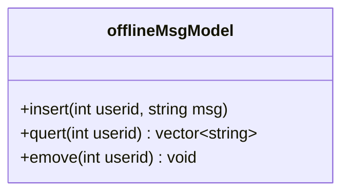


#### 中间件设计

使用redis订阅发布的功能实现的服务器中间件。

## 项目框架

### 单服务器运行逻辑

#### 连接与断开

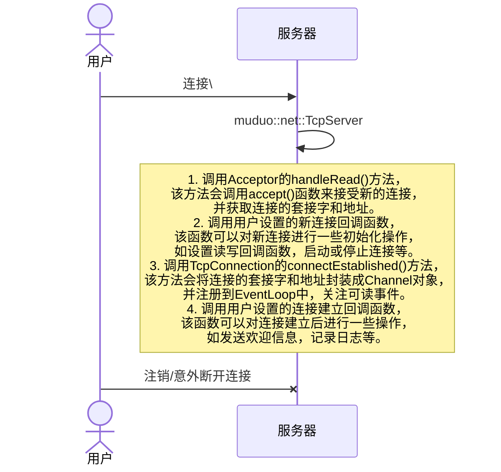

#### 注册、登录、注销

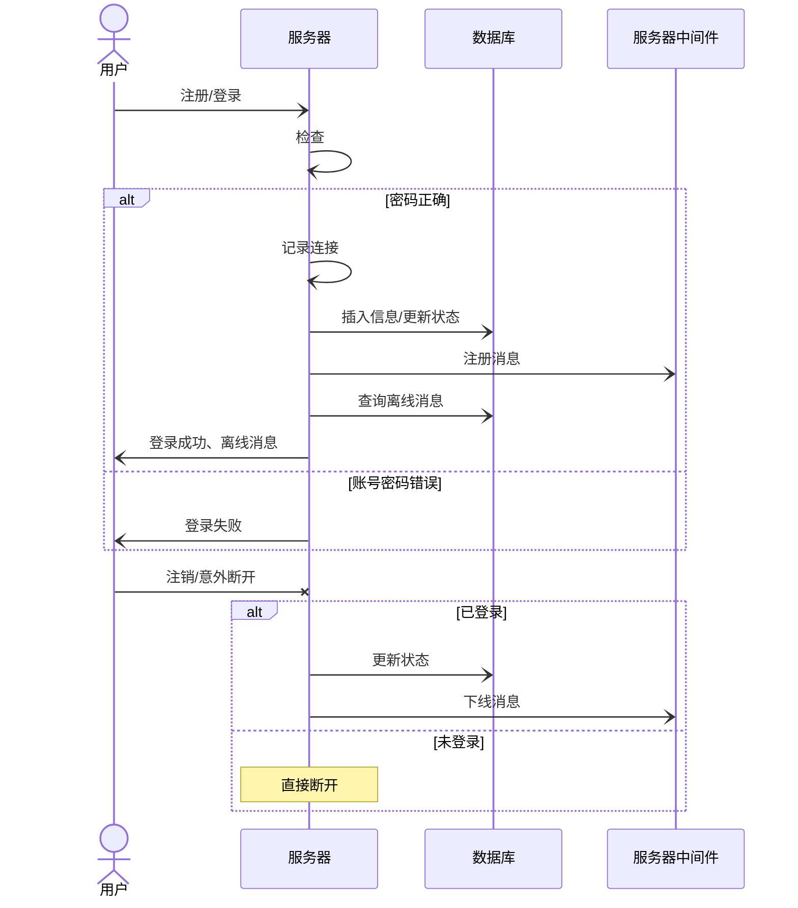

#### 加好友、创建群聊、加入群聊

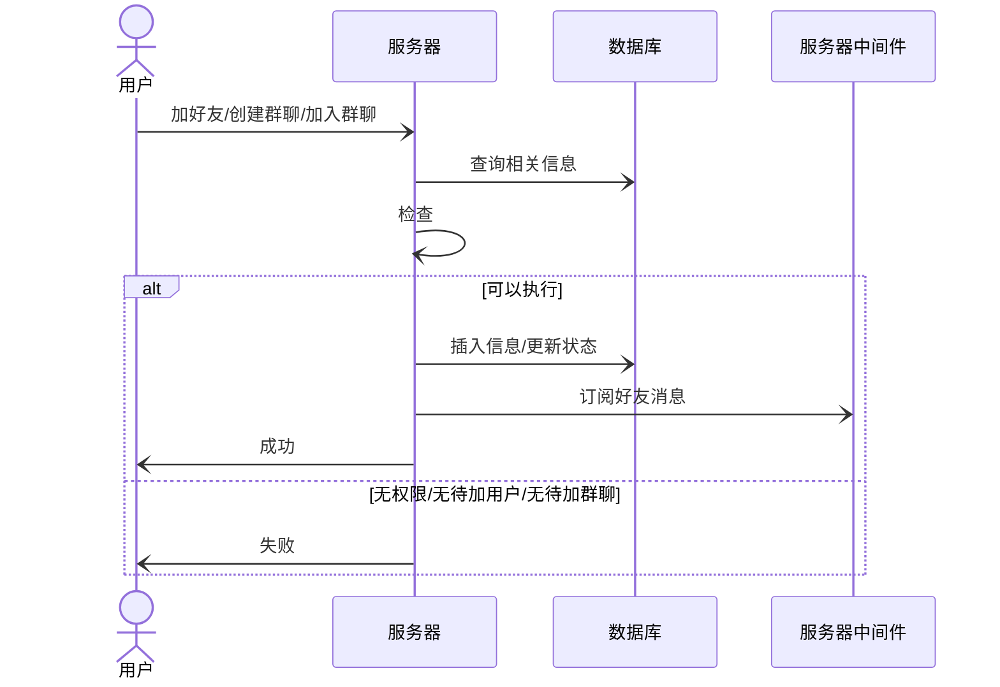

#### 发消息

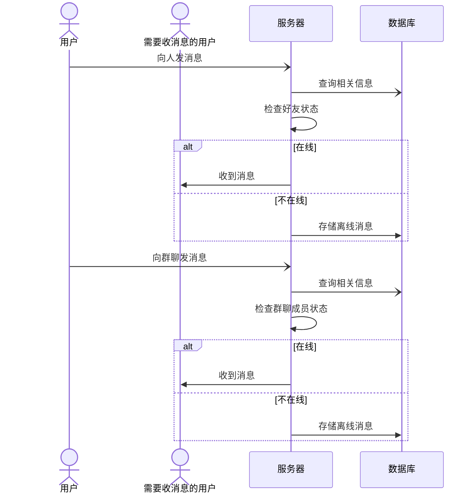


### 集群框架

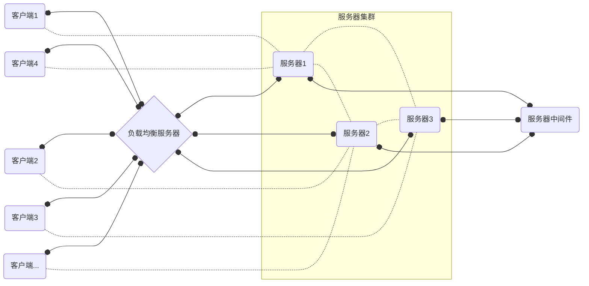


# 项目性能评估